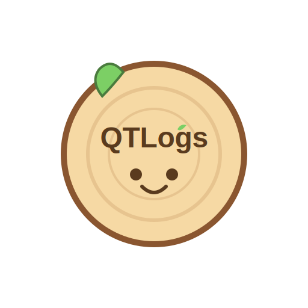

<div  style="display: flex; flex-direction: column; align-items: center;">


</div>


mqtt logging system called QTLogs (cutie)

## Message received  

```json
{
  "from": "app_name",
  "payload": "This is a test log message",
  "level": "info",
  "timestamp": "2024-06-01T12:00:00Z",
  "caller": "file.js:45"
}
```

<a href="https://github.com/ausward/QTLogs">QTLogs</a> © 2025 by Austin Ward is licensed under <a href="https://creativecommons.org/licenses/by-nc-sa/4.0/">Creative Commons Attribution-NonCommercial-ShareAlike 4.0 International</a>
